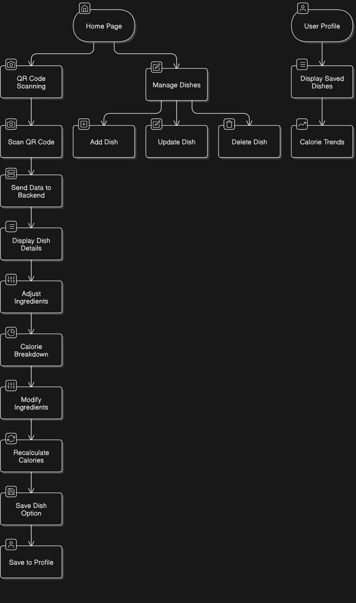

# QR Code-Based Food Calorie Calculator

This project is a web application designed to calculate the calorie count of a dish based on its individual constituents. It includes functionality to scan a QR code containing dish information, retrieve constituent calorie values, dynamically update calorie totals, and manage an inventory of dishes and constituents via a backend API.

---

## **Application Flowchart**



---

## **Features**

### **Frontend (React.js):**
1. **QR Code Scanning:**
   - Scans a QR code containing dish and constituent information.
2. **Dynamic Calorie Calculation:**
   - Displays a detailed calorie breakdown.
   - Updates calorie totals in real time based on quantity adjustments.
3. **User-Friendly Interface:**
   - Provides intuitive controls for modifying item quantities and reviewing calorie updates.

### **Backend (Node.js + MongoDB):**
1. **CRUD APIs:**
   - Manage dishes and their constituents.
   - Add, update, delete, and retrieve calorie data.
2. **Calorie Calculation:**
   - Retrieves calorie information for each constituent and calculates the total for a dish.
3. **Scalable Architecture:**
   - Built to handle large-scale inventory with flexible data structures.

---

## **Tech Stack**

### **Backend:**
- Node.js
- Express.js
- MongoDB (Database)

---

## **Getting Started**

### **Prerequisites**
1. Node.js and npm installed.
2. MongoDB installed locally or access to a MongoDB cloud instance.

### **Setup Instructions**

#### **1. Clone the Repository:**
```bash
git clone https://github.com/ThePratham28/5431-SD5-CalorieCounter.git
cd your-repo-name
```

#### **2. Install Dependencies:**

**Backend:**
```bash
cd backend
npm install
```

#### **3. Configure Environment Variables:**

Create a `.env` file in the `backend` directory and add the following:
```env
PORT=5000
MONGO_URI=mongodb+srv://<username>:<password>@cluster.mongodb.net/<dbname>
JWT_SECRET=your_secret_key
```

Replace `<username>`, `<password>`, and `<dbname>` with your MongoDB credentials.

#### **4. Start the Application:**

**Backend:**
```bash
cd backend
npm start
```

and the backend will run on `http://localhost:8080`.

---

## **API Endpoints**

### **User Routes:**

| Method | Endpoint | Description | Authentication |
|--------|----------|-------------|----------------|
| POST   | `api/user/register` | Register a new user | No |
| POST   | `api/user/login` | Login a user | No |
| GET    | `api/user/logout` | Logout a user | No |
| GET    | `api/user/profile` | Get user profile | Yes |
| POST   | `api/user/save-dish/:dishId` | Save a dish to user profile | Yes |
| DELETE | `api/user/save-dish/:dishId` | Remove a saved dish from user profile | Yes |

### **Dish Routes:**

| Method | Endpoint | Description | Authentication |
|--------|----------|-------------|----------------|
| GET    | `api/dishes/` | Get all dishes | No |
| GET    | `api/dishes/:id` | Get a specific dish by ID | No |
| POST   | `api/dishes/` | Create a new dish | Yes |
| PUT    | `api/dishes/:id` | Update a dish by ID | Yes |
| DELETE | `api/dishes/:id` | Delete a dish by ID | Yes |

---

## **Sample Data**

### Dish Example:
```json
{
  "dishName": "Idli Vada Combo",
  "items": [
    { "name": "Idli", "calories": 100, "defaultQuantity": 2 },
    { "name": "Vada", "calories": 200, "defaultQuantity": 1 },
    { "name": "Sambhar", "calories": 120, "defaultQuantity": 1 },
    { "name": "Chutney", "calories": 80, "defaultQuantity": 1 }
  ]
}
```

### Constituent Example:
```json
{
  "name": "Idli",
  "calories": 100
}
```

---

## **Folder Structure**

```

5431-SD5-CalorieCounter/
├── frontend/
│   ├── src/
│   │   ├── components/
│   │   ├── App.js
│   │   ├── index.js
│   ├── public/
│   ├── package.json
├── backend/
│   ├── src/
│   │   ├── controllers/
│   │   ├── models/
│   │   ├── routes/
│   │   ├── middleware/
│   │   ├── utils/
│   ├── app.js
│   ├── package.json
├── README.md
```

---

## **Contributing**

Contributions are welcome! Please follow these steps:

1. Fork the repository.
2. Create a new branch:
   ```bash
   git checkout -b feature-name
   ```
3. Make your changes and commit:
   ```bash
   git commit -m "Description of feature"
   ```
4. Push to the branch:
   ```bash
   git push origin feature-name
   ```
5. Submit a pull request.

--- 

Let me know if you need adjustments or enhancements! 😊